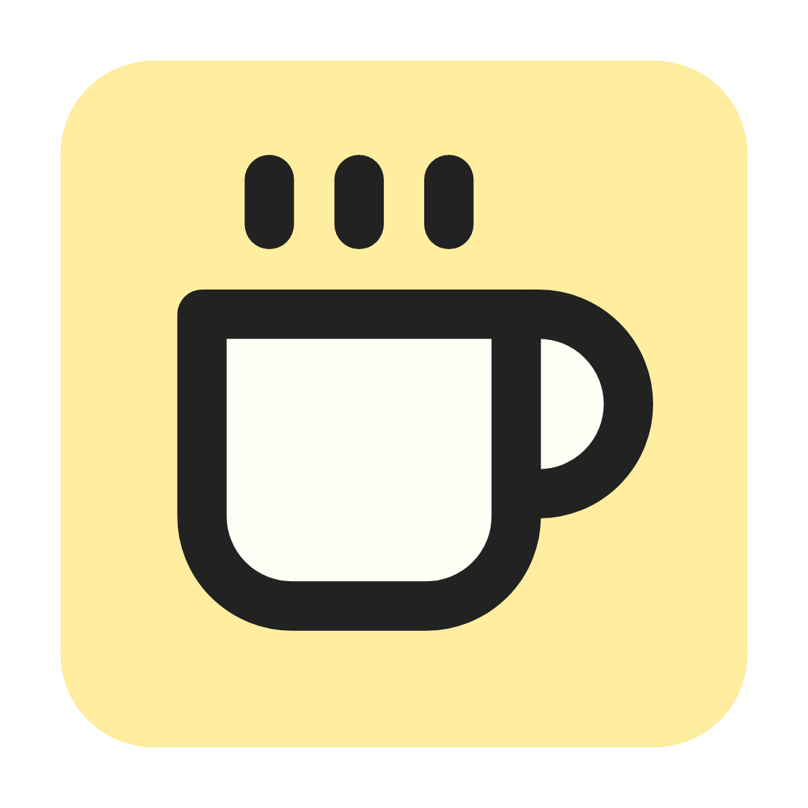

<p align="center">
  
</p>

# ☕️ cafecoworks

A simple, open list of cafés for people who want to work outside the office.

---

## 🚀 Quick Start

1. **Fork** this repository to your GitHub account.
2. **Clone** your fork locally.
3. **Install dependencies:**
   ```bash
   pnpm install
   ```
4. **Add your favorite café** (see below!)
5. **Validate your data:**
   ```bash
   pnpm run validate:cafes
   ```
6. **Submit a Pull Request**

---

## 🤝 How to Contribute

### 1. Add or Edit a Café File

- Create or update a file at:
  ```
  data/<city>/<cafe-slug>.json
  ```
- Use the template: [`data/_template.json`](data/_template.json)

### 2. Add Images

- Place café images in:
  ```
  public/images/<city>/<cafe-slug>/
  ```

### 3. Validate Your Data

- Run the validation script to check your data:
  ```bash
  pnpm run validate:cafes
  ```

### 4. Submit Your Changes

- Open a Pull Request with your changes. We’ll review and merge it!

> **Note:** Please make sure your JSON and images follow the structure and naming conventions below.

---

## 📚 Reference

### Example: Adding "Outsite Cowork Cafe" in Lisbon

- Add/edit:
  `data/lisbon/outsite-cowork-cafe.json`
- Add images:
  `public/images/lisbon/outsite-cowork-cafe/`
- Use the template:
  Copy from [`data/_template.json`](data/_template.json)

### Café JSON Template

When adding a new café, use the following template for your JSON file:

```json
{
  "name": "Cafe Name",
  "slug": "cafe-slug",
  "description": "A short description of the café",
  "city": "City where the café is located",
  "country": "Country where the café is located",
  "address": "Full address of the café",
  "website": "https://cafe-website.com",
  "image": "/images/cafe-slug.jpg",
  "tags": ["wifi", "outlets", "quiet"],
  "lat": 0,
  "lng": 0,
  "station": "Nearest public transport station"
}
```

| Field       | Required | Description                                         | Example                                  |
| ----------- | -------- | --------------------------------------------------- | ---------------------------------------- |
| name        | Yes      | Name of the café                                    | "Outsite Cowork Cafe"                    |
| slug        | Yes      | URL-friendly unique identifier (lowercase, hyphens) | "outsite-cowork-cafe"                    |
| description | Yes      | Short description of the café                       | "A cozy spot with fast WiFi."            |
| city        | Yes      | City where the café is located                      | "Lisbon"                                 |
| country     | Yes      | Country where the café is located                   | "Portugal"                               |
| address     | Yes      | Full address                                        | "Rua de Example, 123"                    |
| website     | Yes      | Website URL                                         | "https://outsite.co"                     |
| image       | Yes      | Path to main image (see image instructions above)   | "/images/lisbon/outsite-cowork-cafe.jpg" |
| tags        | Yes      | Array of tags (e.g., wifi, quiet, outlets)          | ["wifi", "quiet"]                        |
| lat         | No       | Latitude (for map)                                  | 38.12345                                 |
| lng         | No       | Longitude (for map)                                 | -9.12345                                 |
| station     | No       | Nearest public transport station                    | "Cais do Sodré"                          |

---

## 🙌 Thank You for Contributing!

Your help makes it easier for remote workers and digital nomads to find the best spots to work from.

Happy coworking! 🚀
